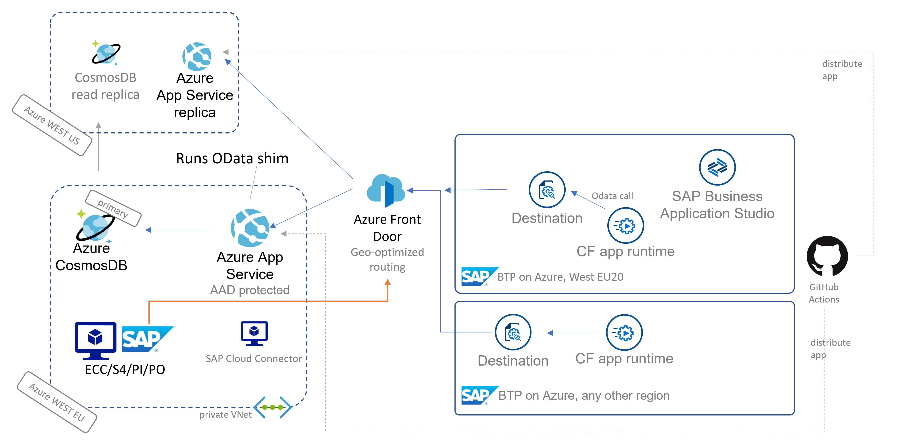

# AzCosmosDB-OData-Shim

Project to connect consumers like SAP Business Technology Platform apps/services via OData with Azure CosmosDB. Furthermore it enables the [geode-pattern](https://docs.microsoft.com/en-us/azure/architecture/patterns/geodes) for global read-access to selected SAP data.

Find the related blog on the SAP community [here]().

Find our public Azure DevOps project for some inspiration on the CI/CD aspect of the solution [here](https://dev.azure.com/mapankra/CosmosDB%20OData%20SAP%20umbrella).

We implemented a simple CI/CD process with classic pipelines. We would recommend to code them in YAML usually, but for a simple entry into this topic we stuck to the more visually "speaking" classic flavor of it.


_Fig.1 architecture overview_

## High-level Prerequisites to replicate our blue print

Our implementation creates a fully functional solution of the geode pattern tested from ECC and S4. The approach is standardized, so that all components could be replaced as long as the runtime environment for the application stays .NET 5. To replicate our particular setup you will need:

- Azure account with subscription and rights to deploy Azure CosmosDB and App Service in two regions
- Azure AD authorization to configure app registration and potentially give admin consent initially
- SAP on Azure with private VNet connectivity or routing from private VNet to SAP on-premise
- SAP BTP account with Business Application Studio, Destination configured and Fiori Launchpad service to host HTML5 app
- Access to SE80 on SAP backend to upload [Z-Programm](ZDemoFrontDoorReport.abap) for data extraction HTTP Post via ABAP.

## Deployment Guide
For step-by-step reproduction find the manual steps below.

### Azure CosmosDB
<details>
<summary>click to expand</summary>

We need at least two instance of Cosmos to verify global access. We configure global read and primary region write to avoid concurrent locking challenges in our blue print. Going forward you might want to think about global write too. In our case SAP backend will always override what is in Cosmos if there is a race condition.

Choose CosmosDB with Core SQL API
#### Basics
- Provide required fields and pay attention to your primary region choice.
- Choose capacity mode Provisioned Throughput to allow multi-region setup
#### Global Distribution
- Keep Geo-Redundancy disabled (we will add regions later)
- Multi-Region Writed disabled (check first section for reasoning)
#### Networking (private VNet required)
- Configure Private endpoint to make Cosmos only accessible from your private VNet that "knows" SAP
#### Backup and Encryption
- Configure as you wish. 

Wait for provisioning to finish.

#### Configure Cosmos Settings
- Replicate data globally -> add read regions as per your needs
- Default Consistency -> Understand your consistency choice and its impact on global read
- Firewall and virtual networks -> familiarize with settings to understand connectivity issues going forward. Allow access from Azure Portal and possibly from your admin ip to begin with. Ultimately your VPN or ExpressRoute connection should be leveraged over your private Azure VNet. In our case we are communication over a P2S VPN with Azure.
- Private Endpoint Connections -> Add a private endpoint for each private VNet in each region, where you are running Cosmos. Meaning you would need additional VNets to achieve private routing.
- Keys -> note down the primary key and URI for your appsettings.json.
</details>

### Azure App Service (Create at least 2 Web Apps)
<details>
<summary>click to expand</summary>

- Instance Details -> Publish Code
- Runtime Stack -> .Net 5
- OS according to your needs. We ran on Windows during our implementation.
- Region -> match your CosmosDB instances (in our case West Europe and West US)
- App Service Plan (SKU) -> can be anything that supports SSL (currently default B1 for instance)

#### Configure App Service
- Essentials -> Health Check -> Enable and put path `/health`
##### Settings
- Networking -> Configure VNet integration with the related VNets where Cosmos private endpoints sit. Be aware you will need enough space for an additional empty subnet.
- Configuration -> Add app setting **geode-name** and put the location name where your app service runs (e.g europe or west us). We will use it later on for our geode service to be able to trace-back easily from where our requests were served
- Configuration -> Add app setting **WEBSITE_VNET_ROUTE_ALL** with value **1**. This ensures that all traffic leaving app service stays on the private VNet, so that it will use the private endpoint of CosmosDB. Otherwise you will see Firewall hits on Cosmos.
</details>

### FrontDoor (global routing based on geo and availability)
<details>
<summary>click to expand</summary>

- Create a resource in any resource group on Azure.
- Fill your desired front-end domain, Session Affinity disabled, WAF disabled
- Add a backend pool with our two azure app service backends (keep defaults "priority" 1 and "weight" 50), fill /health as health probe, https, Probe method HEAD, keep rest as is
- Add routing rule and keep rule defaults as is (pattern match on /* etc.)

Once provisioned pickup Frontend host URL for SAP BTP Destination setup later on.
</details>

### SAP backend for data up-stream
<details>
<summary>click to expand</summary>

- Create a destination named "AzureFrontDoor" for external https connections on **SM59** in your ABAP system
- Fill your FrontDoor address (yourdomain.azurefd.net) and port 443. Alternatively you could fill your private CosmosDB connectivity details and connect directly. The [ABAP SDK for Azure](https://github.com/microsoft/ABAP-SDK-for-Azure) could give you head start doing that. We advise **against** it, because the geode pattern would be bypassed. FrontDoor ensures that you reach the closest App Service and CosmosDB instance that is available.
- Set SSL active and maintain cert-list for Azure SSL certificates. You can do that from transaction **STRUST**. The certificate chain can be exported from any browser when you try to hit your FrontDoor domain and then inspect the certificates. You need to import the whole chain. While writing this doc that was:

    

- Once finished you should make the connection test from SM59 and see http 404 as response. When the process on STRUST was not successfull you will get an SSL handshake error here.
- Repeat the process for destination "AzureADLogin"
- Fill your AD login endpoint login.microsoftonline.com, port 443 and Path prefix: /[your AAD tenant id]/oauth2/v2.0/token
- Activate SSL and check **STRUST** once more if connection test fails

- Create an ABAP program on **SE80** based on the code in [ZDemoFrontDoorReport.abap](ZDemoFrontDoorReport.abap). It will leverage the popular demo data set SFlight.

*Note:*
I highly recommend checking the API calls through Postman first, because the http log on the SAP app server can be tedious. If you need to troubleshoot on SAP you would need to activate http trace info on SMICM, lock your work process on SAPGUI through SE38 (RSTRC000), navigate within that same session to SE80, trigger your progamm, go back to RSTRC000 and release your workpress and finally check the trace file on ST11 for your previously locked work process number.

</details>

### Azure AD (app registration for secure authentication)
<details>
<summary>click to expand</summary>

For simplicity we are configuring the OAuth2 Client Credentials Grant flow. Of course, you could adapt this to any other SAP CloudFoundry Destination supported flow, or replace the need for destination through SAP Cloud SDK or even other apps that integrate with Azure AD like SAP Identity Authentication Service etc.

- Create a new app registration to secure the Cosmos OData shim API exposed by Azure App Service.
- Overview -> note down the application (client) id, AAD tenant id, application ID URI for your appsettings.json locally, Postman requests and App Service environment variables
- Manage -> Certificate & Secrets -> Generate a secret and note it down (visible only once)
- Manage -> App roles -> Add Sflight (Allows access to Sfligh objects), add Reader (Allow app to read from Cosmos) and add Writer (Allow access to write to Cosmos). Those roles are refrenced on the [code](GenericODataWebAPI/Controllers/SflightController.cs)
- Manage -> API permissions -> Add permissions for just created roles and give admin consent. In case admin consent is hard to get and you are in a trial or PoC scenario, you could use a [free Azure subscription](https://azure.microsoft.com/free/) and register your app with that AAD even though the resources actually run in another subscription. Delegated permissions might get you around admin consent too, but require a more complex setup.

</details>

### SAP BTP Destination (one each region)
<details>
<summary>click to expand</summary>

Create a destination named "AzureCosmosDB" on subaccount level on your BTP cockpit (in our case one for west europe and for west us)

Property | Value
--- | --- 
`URL` | [your FrontDoor domain].azurefd.net
`Proxy Type` | Internet
`Authentication` | OAuth2ClientCredentials
`Client ID` | api://[Your app registration id in AAD]
`Client Secret` | the secret you generated in your app registration
`Token Service URL` | https://login.microsoftonline.com/[your AAD tenant id]/oauth2/v2.0/token


#### Additional Properties
Property | Value
--- | --- 
`HTML5.DynamicDestination` | value true
`scope` | "Your app registration id in AAD" (same as Client ID) **without** "api://" at the beginning **and** with suffix `/.default` at the end.
`WebIDEEnabled` | true
`WebIDEUsage` | odata_abap

</details>

### SAP BTP HTML5 App ([source in second repos](https://github.com/MartinPankraz/SAPUI5-CosmosDB-umbrella))
<details>
<summary>click to expand</summary>

Find the source for the consuming SAPUI5 app [here](https://github.com/MartinPankraz/SAPUI5-CosmosDB-umbrella).

- clone from GitHub and run in Business Application Studio with npm start or right click the webapp folder -> preview application
- build and deploy to cloud foundry the [usual way](https://developers.sap.com/tutorials/appstudio-sapui5-create.html#294b8b1d-0791-4e31-b9b1-525e533557c0)
- To be able to consume the HTML5 app you need to add a hosting service. We choose the SAP Fiori Launchpad service.

    

</details>

## Postman config to test OData API

For developer convenience we provide a Postman environment and collection in the [Templates folder](Templates).

Fill the details you collected from your app registration on AAD on the environment and pay attention to the difference between client_id and scope. They use the same id but have different prefix and suffix. We didn't provide fixed values for the prefix, because they can be altered by you during creation on Azure.


The **Tests** tab writes the env variable bearerToken, which is used for all calls in the collection, that require authentication.

Public interfaces are:

- /health
- /api/geode
- /api/odata/$metadata
- /api/odata?$metadata

Protected interfaces are:

- /api/odata/*

## Publish OData API to Azure App service

For developer convenience we added a [publish.bat](publish.bat) file that builds your project and uploads the content to your app service.
```
.\publish.bat [your resource group] [name of app service]
```
You need Azure CLI setup for Powershell and an open session (az login) or install/configure Azure extension for Visual Studio Code for integrated experience. I would recommend the latter ;-)

# Final words

Feel free to reach out over GitHub Issues in case of any questions :-) Until then happy integrating and enjoy reading your SAP data globally.